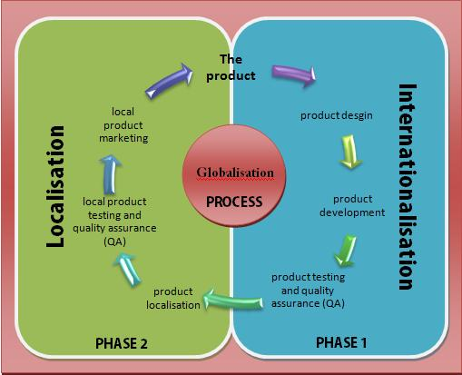
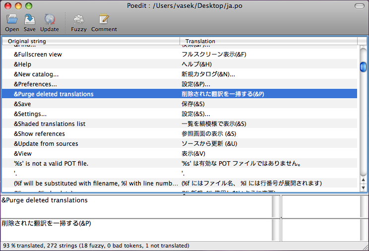
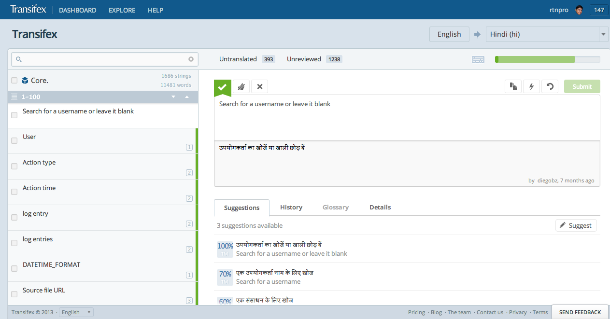
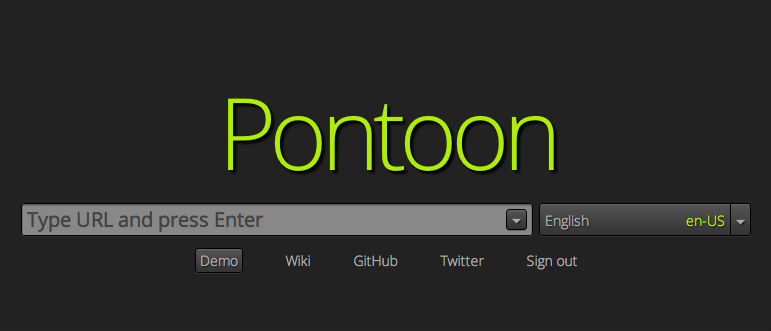
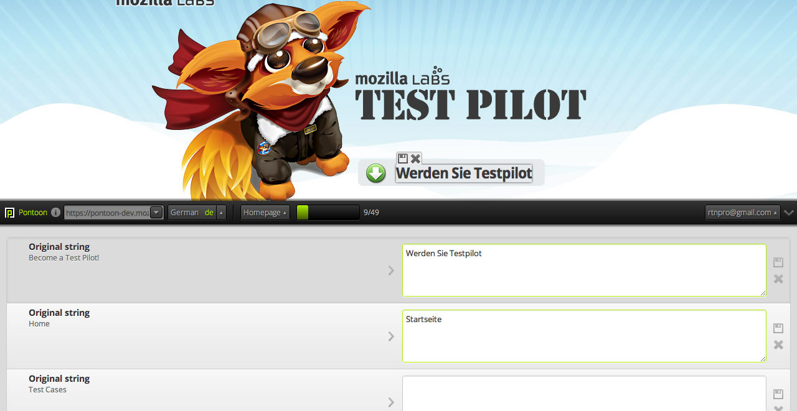

Develop for an international audience
#####################################
:Speaker: Ratnadeep Debnath
:Slides: https://github.com/rtnpro/fsmk_l10n_talk/

About me
--------
* Worked at `www.transifex.com <https://www.transifex.com>`_.
* Contributes to Mozilla, Fedora, etc.
* rtnpro@gmail.com
* @rtnpro at Freenode, Twitter
* https://github.com/rtnpro
* http://ratnadeepdebnath.wordpress.com

Goals
-----
* Introduction to localization.
* Why is it needed?
* Quick start your FOSS contribution.
* Some details
* Know your tools
* Where to start?

What?
-----
**Localization** the process of translating a product into different languages or adapting a product for a specific country or region.

Why?
----
* Preserve our cultural heritage
* 95% people on the Earth with native language other than English
* 50% internet users speak no English at all
* Around 120 published languages on ``wordpress.com``
* 4X chances to buy from a website in native language
* $25 additional revenue per $1 spent on localization

Keep of with the terms ;)
-------------------------
* i18n: Internationalization
* l10n: Localization

Get your feet wet
-----------------
* Localization: A good way to start contributing.
* Know the tools
* Make friends
* Learn from them

Let's get into details
----------------------
* Basic steps for i18n and l10n
* i18n formats
* Python and Gettext

Basic steps for i18n and l10n
-----------------------------
* Mark translation strings
* Extract them (PO files)
* Translate them
* Compile them (MO files)
* Load them in application

i18n formats
------------
* Gettext (``*.po``, ``*.pot`` files)
* Qt (``*.ts`` files)
* XLIFF (``*.xliff``, ``*xml`` files)
* YAML (``*.yml`` files)
* and lots more... **Gettext is the most popular one :)**

Python & Gettext
----------------
.. code-block:: python

    from gettext import gettext as _

    string  = _(u'A sentence to translate')

Simple! Isn't it?

Let's take a look at an example from

https://github.com/rtnpro/pycon_india_2012_i18n_and_l10n/tree/master/examples/python

Initialize
==========

.. code-block:: python

   import gettext

   # Set up message catalog access
   t = gettext.translation('myapplication', 'locale', fallback=True)
   _ = t.ugettext

Usage
=====

.. code-block:: python

   def greet_user(user):
       print _(u'Hello, %s.') % user

Extract
=======

.. code-block:: bash

   xgettext -d myapplication -o app.pot l10n.py
   vim app.pot

PO file headers
---------------

.. code-block:: gettext

    # MyApplication
    # Copyright (C) 2012 Apostolis Bessas
    # This file is distributed under the same license as the MyApplication package.
    # Apostolis Bessas <mpessas@transifex.com>, 2012.
    #
    #, fuzzy
    msgid ""
    msgstr ""
    "Project-Id-Version: 0.1\n"
    "Report-Msgid-Bugs-To: http://github.com/mpessas/going_international/issues\n"
    "POT-Creation-Date: 2012-06-30 09:45+0300\n"
    "PO-Revision-Date: YEAR-MO-DA HO:MI+ZONE\n"
    "Last-Translator: FULL NAME <EMAIL@ADDRESS>\n"
    "Language-Team: LANGUAGE <LL@li.org>\n"
    "Language: \n"
    "MIME-Version: 1.0\n"
    "Content-Type: text/plain; charset=UTF-8\n"
    "Content-Transfer-Encoding: 8bit\n"
    "Plural-Forms: nplurals=INTEGER; plural=EXPRESSION;\n"

POT file content
----------------

.. code-block:: gettext

    #: l10n.py:10
    #, python-format
    msgid "Hello, %s."
    msgstr ""

    #: l10n.py:17
    #, python-format
    msgid "You have %s child"
    msgid_plural "You have %s children"
    msgstr[0] ""
    msgstr[1] ""

PO files
--------

.. code-block:: bash

    mkdir -p locale/en/LC_MESSAGES/
    msginit -i app.pot -o locale/en/LC_MESSAGES/en.po -l en
    msgfmt locale/en/LC_MESSAGES/en.po -o \
        locale/en/LC_MESSAGES/myapplication.mo

    mkdir -p locale/it/LC_MESSAGES/
    msginit -i app.pot -o locale/it/LC_MESSAGES/it.po -l it
    msgfmt locale/it/LC_MESSAGES/it.po -o \
        locale/it/LC_MESSAGES/myapplication.mo

    mkdir -p locale/el/LC_MESSAGES/
    msginit -i app.pot -o locale/en/LC_MESSAGES/el.po -l el
    msgfmt locale/el/LC_MESSAGES/el.po -o \
        locale/el/LC_MESSAGES/myapplication.mo

Running
-------

.. code-block:: bash

    bash> LANG=it python l10n.py
    Ciao, John
    You have 1 child
    Ciao, Mary.
    You have 3 children

Traditional l10n tools
----------------------
* Lokalize
* PoEdit

Lokalize
--------
.. image:: images/lokalize.png
   :align: center
   :width: 1080px
   :height: 800px

Poedit
------

Workflow
--------
* Mark translate strings, export
* Release string freeze
* Translator: VCS checkout
* Translate w/ specialized tools
* Get 'em files back: SSH, email, tickets
* For every friggin release

Challenges
----------
* Too darn hard
* Community isolation
* Quality
* Scalability
* Always more languages, more users

Modern solutions
----------------
* Localization workflow management tools on the cloud, e.g., **Transifex**
* **Pontoon**: A tool from Mozilla for live website localization

Transifex
---------

Pontoon
-------

* Live website localization
* Configurable with various backends like Transifex, Pootle, etc.
* Very intuitive
* Support for various web frameworks: **PHP**, **Django** (others will follow)
* Helps localize non i18n-ized websites
* Open Source
* Contribute: https://github.com/mathjazz/pontoon

Pontoon
-------

Where to start?
---------------
* Fedora https://translate.fedoraproject.org/
* Gnome https://live.gnome.org/TranslationProject
* KDE http://l10n.kde.org/docs/translation-howto/
* Mozilla https://wiki.mozilla.org/L10n
* or any other project that interests you, e.g, `VLC <http://www.videolan.org/developers/i18n/>`_.

Questions?
----------

Thanks :)
---------

